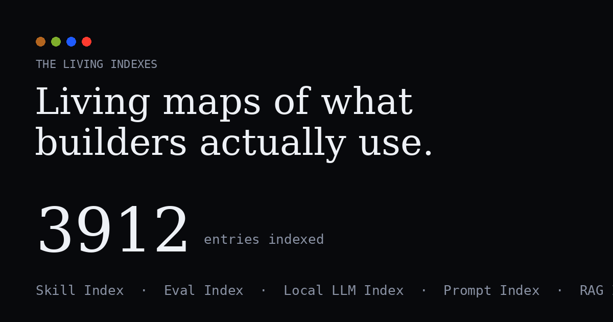

<div align="center">

# The Living Indexes

### Living maps of what builders actually use.

[](https://indexes.kymatalabs.com)
&nbsp;

&nbsp;

&nbsp;


<a href="https://indexes.kymatalabs.com"></a>

**[Open the hub →](https://indexes.kymatalabs.com)**

</div>

---

## What it is

**The Living Indexes** is the hub for a fleet of self-updating indexes of the AI-builder ecosystem.
Each index is its own site, recomputed every day from live GitHub signals; this hub aggregates their
**live counts and top movers** into one place and links out to each — a single map of the whole stack.

> 🔗 **Live:** [indexes.kymatalabs.com](https://indexes.kymatalabs.com)

## The fleet

| Index | What it tracks |
|---|---|
| [The Skill Index](https://skill.kymatalabs.com) | Claude Code & AI-agent skills, subagents, hooks |
| [The Eval Index](https://eval.kymatalabs.com) | LLM/agent evaluation, benchmark & red-teaming tools |
| [The Local LLM Index](https://localllm.kymatalabs.com) | Running LLMs locally — engines, runners, quantization |
| [The Prompt Index](https://prompt.kymatalabs.com) | Prompt-engineering resources — collections, system prompts |
| [The RAG Index](https://rag.kymatalabs.com) | RAG frameworks, vector DBs, embeddings, reranking |
| [The Fine-Tuning Index](https://finetune.kymatalabs.com) | Fine-tuning & post-training — PEFT/LoRA, RLHF/DPO |
| [StackTracker](https://stacktracker.kymatalabs.com) | The momentum index for AI-infrastructure repos |
| [Model Radar](https://modelradar.kymatalabs.com) | What's surging on Hugging Face right now |
| [The MCP Index](https://mcp.kymatalabs.com) | Every Model Context Protocol server |
| [Agent Velocity](https://agentvelocity.kymatalabs.com) | The open-source coding-agent race |

## How it works

`build_data.py` fetches each index's published `data.json` **server-side at build time** (so there's
no CORS step), normalizes the differing schemas, and writes a combined summary with live counts +
top movers. A **daily GitHub Action** refreshes it and redeploys to Vercel — so the hub always
reflects the fleet as it stands today.

```
each index's /data.json   →   build_data.py   →   data.json   →   deploy.py   →   ⟳ daily cron
   (10 live sources)          (aggregate)        (the hub)       (Vercel REST)    (GitHub Action)
```

## Run it locally

```bash
python3 build_data.py && python3 gen_og.py
python3 -m http.server 8080   # open http://localhost:8080
```

Static HTML/CSS/JS — no framework, no build step.

## Tech

`Python` (aggregator) · static `HTML/CSS/JS` · `Vercel` (hosting) · `GitHub Actions` (daily cron).

---

<div align="center">

© 2026 **Kymata Labs LLC**. The Living Indexes is a self-updating reference, recomputed daily.

</div>
